# FlowShare V2

> **Production-Grade Automated Hydrocarbon Allocation Platform for Oil & Gas Joint Ventures**

[](https://cloud.google.com/run)
[](https://ai.google.dev/)
[](https://nextjs.org/)
[](https://fastapi.tiangolo.com/)
[](https://www.typescriptlang.org/)
[](https://www.python.org/)

FlowShare V2 is a full-stack SaaS application that automates petroleum allocation calculations for joint venture operations, reducing reconciliation time from weeks to minutes with 99.9% accuracy using industry-standard API MPMS 11.1 formulas.

---

## 🎯 What is FlowShare V2?

FlowShare V2 streamlines the complex process of allocating crude oil production among multiple partners in a joint venture. It combines:

- **AI-Powered Validation** - Gemini API detects anomalies in production data
- **Automated Calculations** - API MPMS 11.1 petroleum allocation standards
- **Event-Driven Architecture** - Asynchronous processing with AI agents
- **Multi-Tenant SaaS** - Secure, isolated data for each organization
- **Real-time Analytics** - Production insights

**Live Application:** [https://flowshare-frontend-226906955613.europe-west1.run.app/](https://flowshare-frontend-226906955613.europe-west1.run.app/)

**Demo Admin Panel:** [https://flowshare-frontend-226906955613.europe-west1.run.app/demo-admin](https://flowshare-frontend-226906955613.europe-west1.run.app/demo-admin) (Password: `FlowShare@Demo2025`)

**API Documentation:** [https://flowshare-backend-api-226906955613.europe-west1.run.app/docs](https://flowshare-backend-api-226906955613.europe-west1.run.app/docs)

**Demo Video:** [Watch on Youtube](https://youtu.be/b0BSD6JAadU)

**Blog Post:** [Read on Medium](https://medium.com/@todak2000/building-flowshare-how-i-built-a-multi-agent-system-on-google-cloud-run-a6dd577989e2)

### Key Benefits

✅ **95% faster reconciliation** (weeks → minutes)
✅ **99.9% calculation accuracy** using industry standards
✅ **AI anomaly detection** prevents costly disputes
✅ **Complete audit trail** with Excel exports
✅ **Multi-role access** for coordinators, partners, and operators

---

## 🏗️ Architecture Overview

FlowShare V2 is built on a **serverless, event-driven, multi-agent architecture** deployed entirely on Google Cloud Platform.

<p align="center">
  
</p>

### Architecture Highlights

- **5 Cloud Run Services**: Frontend (Next.js), Backend API (FastAPI), 3 AI Agents
- **Event-Driven**: Asynchronous communication via Cloud Pub/Sub (6 topics)
- **Multi-Agent System**: Specialized agents (Auditor, Accountant, Communicator)
- **Serverless & Auto-Scaling**: Scale from 0 to 10 instances automatically
- **Multi-Tenant**: Secure data isolation per organization

### Cloud Run Architecture Pattern

Our agents use **Cloud Run Services** (not Worker Pools or Jobs) with **Pub/Sub pull subscriptions**:

```python
# Each agent runs a FastAPI server for health checks
app = FastAPI(lifespan=lifespan)

@app.get("/")
async def health_check():
    return {"status": "healthy"}

# Plus a background task that pulls from Pub/Sub
async def run_subscriber_worker():
    subscriber = SubscriberClient()
    future = subscriber.subscribe(subscription_path, callback=process_message)
    await asyncio.Event().wait()  # Keep alive
```

**Why this pattern?**
- ✅ Health endpoints for Cloud Run monitoring
- ✅ Scale to zero when idle ($0 cost)
- ✅ Instant scale-up when events arrive
- ✅ Standard deployment (no special Worker Pool setup)

📖 **Detailed Architecture**: See [ARCHITECTURE.md](./ARCHITECTURE.md) for complete technical deep-dive

---

## 🚀 Why Cloud Run?

After evaluating multiple deployment options (GKE, Compute Engine, Cloud Run Jobs, Cloud Run Worker Pools), we chose **Cloud Run Services + Pub/Sub** for our multi-agent architecture.

### Key Benefits

**💰 Cost Efficiency**
- Agents scale to **zero when idle** (no events = $0 cost)
- Only pay for actual compute time (not idle instances)
- Development: ~$5/month | Production: ~$50/month
- vs GKE: Would be ~$200/month minimum

**⚡ Auto-Scaling**
- **0 → 10 instances** in seconds when events arrive
- Each agent scales independently based on its queue depth
- No manual capacity planning needed

**🚀 Fast Deployment**
- **2-3 minutes** from commit to production
- GitHub Actions → Docker build → Cloud Run deploy
- Zero-downtime deployments with automatic rollback

**🛠️ Developer Experience**
- Run standard Python web frameworks (FastAPI, Flask)
- Test locally with Docker
- Built-in HTTPS and health checks
- Simple CI/CD integration

### Real-World Performance

**Scenario**: Monday morning, 50 partners submit production data simultaneously

| Without Multi-Agent (Monolith) | With Multi-Agent (Cloud Run) |
|--------------------------------|------------------------------|
| 50 requests queue up | 50 requests complete in <500ms |
| Each waits for validation (3-5s) | Validation happens async |
| 5+ minute delays | Users see success immediately |
| Single bottleneck | Independent scaling per agent |

**Result**: Users get instant responses, processing happens in background

📖 **Why Cloud Run?**: See [ARCHITECTURE.md - Why Cloud Run](./ARCHITECTURE.md#why-cloud-run) for detailed analysis

---

## 📁 Project Structure

```
flowshare-v2/
├── frontend/                    # Next.js 15 application
│   ├── src/
│   │   ├── app/                # App Router pages
│   │   ├── components/         # React components
│   │   ├── lib/                # Utilities & config
│   │   ├── hooks/              # Custom React hooks
│   │   └── types/              # TypeScript types
│   ├── package.json
│   └── README.md              # 👉 Frontend Documentation
│
├── backend/                    # FastAPI application
│   ├── api/                   # REST API routers
│   │   ├── main.py            # FastAPI app
│   │   └── routers/           # 12 API routers
│   ├── agents/                # AI microservices
│   │   ├── auditor/           # Data validation agent
│   │   ├── accountant/        # Allocation engine
│   │   └── communicator/      # Notification agent
│   ├── shared/                # Shared code
│   │   ├── models/            # Pydantic models
│   │   ├── auth/              # Authentication
│   │   ├── database/          # Firestore client
│   │   └── ai/                # Gemini service
│   ├── tests/                 # Unit tests
│   ├── requirements.txt
│   └── README.md              # 👉 Backend Documentation
│
├── .gitignore
└── README.md                   # This file
```

---

## 🚀 Quick Start

### Prerequisites

- **Node.js 18+** (for frontend)
- **Python 3.11+** (for backend)
- **Docker & Docker Compose** (optional, for local development)
- **Google Cloud Project** with Firestore, Pub/Sub, and Firebase

### Local Development Setup

#### 1. Clone the Repository

```bash
git clone https://github.com/todak2000/flowshare-v2.git
cd flowshare-v2
```

#### 2. Start Backend

```bash
cd backend
python -m venv venv
source venv/bin/activate  # On Windows: venv\Scripts\activate
pip install -r requirements.txt
uvicorn api.main:app --reload
```

**Backend runs on**: `http://localhost:8000`

📖 **See detailed setup**: [backend/README.md](./backend/README.md)

#### 3. Start Frontend

```bash
cd frontend
yarn install  # or npm install
yarn dev      # or npm run dev
```

**Frontend runs on**: `http://localhost:3000`

📖 **See detailed setup**: [frontend/README.md](./frontend/README.md)

---

## 📚 Documentation

### Detailed Documentation

- **[Backend Documentation](./backend/README.md)** - API endpoints, AI agents, allocation engine, deployment
- **[Frontend Documentation](./frontend/README.md)** - Components, routing, state management, styling

### Key Features Documentation

**Backend**:
- REST API (12 routers)
- AI Agent Infrastructure
- API MPMS 11.1 Allocation Engine
- Event-Driven Architecture
- Multi-Tenant Security
- SCADA Integration

**Frontend**:
- Next.js 15 App Router
- Server & Client Components
- Real-time Validation
- Dark/Light Mode
- Role-Based UI
- Excel Export

---

## 🧪 Testing

### Backend Tests

```bash
cd backend
python -m pytest tests/unit/ -v
```

### Frontend Tests

```bash
cd frontend
yarn test --run
```

---

## 🛠️ Technology Stack

### Frontend
- **Framework**: Next.js 15, React 19, TypeScript
- **UI**: Tailwind CSS, shadcn/ui, Radix UI, Framer Motion
- **State**: TanStack Query, Zustand
- **Forms**: React Hook Form, Zod
- **Auth**: Firebase Authentication

### Backend
- **Framework**: FastAPI, Python 3.11+
- **Database**: Google Cloud Firestore
- **Events**: Google Cloud Pub/Sub
- **AI**: Google Gemini API
- **Auth**: Firebase Admin SDK

### Infrastructure
- **Cloud**: Google Cloud Platform
- **Database**: Firestore (NoSQL)
- **Messaging**: Pub/Sub
- **AI**: Gemini API
- **Storage**: Cloud Storage
- **Email**: ZeptoMail

---

## ☁️ Google Cloud Platform Services

FlowShare V2 leverages **7 GCP services** strategically integrated for a production-grade, serverless architecture:

### Core Services (Active)

**1. Cloud Run** - Serverless Container Platform
- **5 microservices** deployed (frontend, API, 3 agents)
- **Auto-scaling**: 0-10 instances per service
- **Region**: europe-west1
- **Total resources**: 4.5 Gi RAM, 8 vCPUs allocated across services
- **Why**: Serverless compute with scale-to-zero cost savings

**2. Cloud Pub/Sub** - Event Messaging
- **6 topics** for inter-service communication
- **6 pull subscriptions** for agents
- **Delivery**: At-least-once with retry logic
- **Why**: Decouples services, enables event-driven architecture

**3. Cloud Firestore** - NoSQL Database
- **9 collections** for multi-tenant data
- **Composite indexes** for optimized queries
- **Multi-region replication** for reliability
- **Why**: Serverless database with flexible schema and built-in scaling

**4. Cloud Secret Manager** - Secrets Storage
- **5+ secrets** (API keys, service accounts, passwords)
- **Version control** for secrets
- **IAM-based access** control
- **Why**: Secure credential management without hardcoding

**5. Artifact Registry** - Container Images
- **5 image repositories** (one per service)
- **Vulnerability scanning** enabled
- **Tagged with git SHA** for traceability
- **Why**: Private Docker registry integrated with Cloud Run

**6. Gemini API** - AI Models
- **2 models used**: gemini-2.0-flash-exp (analysis), gemini-2.5-flash (chat)
- **Use cases**: Anomaly detection, reconciliation insights, FlowshareGPT
- **Rate limiting**: 60 requests/min with retry logic
- **Why**: Production-grade AI without training custom models

**7. Firebase Authentication** - User Management
- **JWT tokens** for API authentication
- **Custom claims** for RBAC (role-based access control)
- **Email/password** authentication
- **Why**: Managed auth service with client + server SDKs

### Planned Services (Next Phase)

- ⏳ **BigQuery**: Analytics data warehouse for historical production analysis
- ⏳ **Cloud Storage**: Long-term archival of reconciliation exports
- ⏳ **Cloud Monitoring**: Custom dashboards, SLIs, SLOs
- ⏳ **Cloud Logging**: Structured log aggregation
- ⏳ **Cloud Trace**: Distributed tracing across services
- ⏳ **Vertex AI**: Custom ML models for production forecasting

📖 **Complete GCP Integration**: See [ARCHITECTURE.md - GCP Services](./ARCHITECTURE.md#google-cloud-platform-services) for detailed breakdown

---

## 🎓 Key Learnings

### What Worked Exceptionally Well ✅

**Event-Driven Architecture**
- Pub/Sub decoupling made the system incredibly resilient
- When Auditor agent went down for 30 minutes, messages queued and were processed when it came back up - zero data loss
- **Takeaway**: For any async processing, event-driven > direct API calls

**Cloud Run Auto-Scaling**
- Scale-to-zero provided real cost savings
- Development costs <$5/month because agents are idle 23 hours/day
- **Takeaway**: Serverless is perfect for variable, event-driven workloads

**Firestore for Multi-Tenant SaaS**
- NoSQL flexibility + built-in scaling is powerful
- Adding new fields (like `ai_analysis`) required zero migrations
- **Takeaway**: For SaaS with evolving schema, NoSQL > SQL

**FastAPI + Background Tasks**
- Running Pub/Sub subscriber as background task in FastAPI works great
- Single service handles HTTP (health checks) + Pub/Sub (events)
- **Takeaway**: No need for separate worker processes, simplifies deployment

### What Was Challenging ⚠️

**Cold Starts**
- First request after idle took 2-3 seconds
- **Solution**: Optimized Docker images (multi-stage builds, 60% size reduction)
- **Result**: Cold start acceptable for background agents (~2s)
- **Lesson**: For user-facing APIs, set min-instances=1

**Gemini API Rate Limiting**
- Hit rate limits during high-volume testing
- **Solution**: Exponential backoff retry, request queuing, used different models
- **Result**: Zero rate limit errors in production
- **Lesson**: Always implement retry logic for external APIs

**Pub/Sub Message Ordering**
- Messages don't arrive in order (e.g., "edit" before "create")
- **Solution**: Include full entry data in message payload, use Firestore as source of truth
- **Result**: Agents are idempotent, handle out-of-order messages correctly
- **Lesson**: Don't rely on Pub/Sub ordering unless explicitly configured

**Secret Manager JSON Formatting**
- Firebase credentials JSON was getting corrupted (newlines, escaping)
- **Solution**: Proper base64 encoding, heredoc syntax with `gcloud secrets create`
- **Result**: Reliable secret storage and retrieval
- **Lesson**: Test secret storage/retrieval in CI/CD pipeline

### What We Would Do Differently 🔄

**1. Observability from Day One**
- Missing: Cloud Monitoring dashboards, structured logging, distributed tracing
- **Impact**: Difficult to debug production issues, can't prove "production-ready" claims
- **Fix**: Implement observability stack (Monitoring, Logging, Trace) immediately in next phase

**2. Agent Testing**
- Agents have limited unit tests
- **Impact**: Risky deployments, no regression testing for agent logic
- **Fix**: Comprehensive agent tests (mocking Pub/Sub, Firestore, Gemini)

**3. Load Testing**
- Only tested with ~50 concurrent users
- **Impact**: Don't know true scalability limits
- **Fix**: Use Locust or k6 to load test with 1000+ concurrent users

📖 **Complete Learnings**: See [ARCHITECTURE.md - Key Learnings](./ARCHITECTURE.md#key-learnings) for full retrospective

---

## 🔑 Key Features

### 1. Production Data Management
- Submit and track daily production data
- AI-powered anomaly detection
- Real-time validation and approval workflow
- Partner-specific data access

### 2. Automated Reconciliation
- API MPMS 11.1 allocation calculations
- One-click reconciliation trigger
- Detailed allocation breakdown per partner
- Excel export with step-by-step calculations
- AI-generated insights

### 3. Team Management
- Multi-role access control (Coordinator, Partner, Field Operator, Auditor)
- Email invitation system
- Notification preferences
- Partner limit enforcement based on subscription

### 4. Analytics
- Production trend analysis
- Shrinkage tracking
- Partner breakdown visualizations

### 5. SCADA Integration
- API key-based authentication
- Automated data ingestion
- Test/production environment support
- Complete API documentation

### 6. FlowshareGPT
- AI chat interface powered by Gemini
- Context-aware data analysis
- Natural language queries about production data

---

## 🔒 Security Features

- ✅ Firebase Authentication with JWT tokens
- ✅ Role-based access control (RBAC)
- ✅ Multi-tenant data isolation
- ✅ API key authentication for SCADA
- ✅ Input validation and sanitization
- ✅ XSS prevention
- ✅ Rate limiting
- ✅ Security headers (CSP, HSTS)
- ✅ Audit logging

---

## 📊 Subscription Plans

| Feature | Starter | Professional | Enterprise |
|---------|---------|--------------|------------|
| **Partners** | 5 | 15 | Unlimited |
| **Reconciliations/Month** | 12 | 50 | Unlimited |
| **Analytics** | ✅ | ✅ | ✅ |
| **API Access** | ❌ | ✅ | ✅ |
| **Support** | Email | Priority | Dedicated |
| **Price** | Free | $149/mo | $399/mo |

---

## 🚢 Deployment

### Production Services

All services are deployed on Google Cloud Run in the `europe-west1` region:

| Service | URL | Status |
|---------|-----|--------|
| **Frontend** | [flowshare-frontend-226906955613.europe-west1.run.app](https://flowshare-frontend-226906955613.europe-west1.run.app) | ✅ Live |
| **Backend API** | [flowshare-backend-api-226906955613.europe-west1.run.app](https://flowshare-backend-api-226906955613.europe-west1.run.app) | ✅ Live |
| **Auditor Agent** | `flowshare-auditor-agent-226906955613.europe-west1.run.app` | ✅ Live |
| **Accountant Agent** | `flowshare-accountant-agent-226906955613.europe-west1.run.app` | ✅ Live |
| **Communicator Agent** | `flowshare-communicator-agent-226906955613.europe-west1.run.app` | ✅ Live |

### Automated Deployment

Deployments are automated via GitHub Actions:

- **Frontend**: Triggered on push to `main` branch with changes in `frontend/` directory
- **Backend API & Agents**: Triggered on push to `main` branch with changes in `backend/` directory

### Secret Management

Secrets are securely stored in **Google Cloud Secret Manager**:

- `FIREBASE_CREDENTIALS_JSON` - Complete Firebase service account credentials (preferred method)
- `GEMINI_API_KEY` - Google Gemini API key for AI features
- `ZEPTO_TOKEN` - Email service authentication
- `DEMO_PASSWORD` - Demo admin panel password
- `SWAGGER_USERNAME` / `SWAGGER_PASSWORD` - API documentation access

### Manual Deployment

```bash
# Deploy all services
cd /path/to/flowshare-v2
git add .
git commit -m "Your changes"
git push origin main
```

GitHub Actions will automatically build Docker images and deploy to Cloud Run.

📖 **Detailed deployment instructions**: See [backend/README.md](./backend/README.md#deployment) and [frontend/README.md](./frontend/README.md#deployment)

---

## 🧑‍💻 Try It Out - Demo Guide

### Quick Start (No Setup Required)

**Live Application**: [https://flowshare-frontend-226906955613.europe-west1.run.app/](https://flowshare-frontend-226906955613.europe-west1.run.app/)

### Option 1: Demo Admin Access (Pre-loaded Data)

**URL**: [https://flowshare-frontend-226906955613.europe-west1.run.app/demo-admin](https://flowshare-frontend-226906955613.europe-west1.run.app/demo-admin)

**Password**: `FlowShare@Demo2025`

**What's Included**:
- Pre-loaded joint venture with 4 partners (Shell, Chevron, NNPC, TotalEnergies)
- Sample production entries (approved, flagged, pending)
- Completed reconciliations with AI insights
- Full access to all features

**Test Scenarios**:
1. **View Dashboard** - See production trends and analytics
2. **Submit New Entry** - Add production data, watch AI validation
3. **Trigger Reconciliation** - Run allocation for current period
4. **Review AI Insights** - Check Gemini-generated analysis
5. **Export Report** - Download Excel with detailed calculations
6. **Chat with FlowshareGPT** - Ask questions about production data

### Option 2: Create Your Own Account

1. **Sign Up**: [Register here](https://flowshare-frontend-226906955613.europe-west1.run.app/auth/signup)
2. **Create Organization**: Set up your joint venture
3. **Invite Partners**: Add team members via email
4. **Submit Data**: Enter production measurements
5. **Run Reconciliation**: Allocate volumes across partners

### API Documentation & Testing

**Swagger UI**: [https://flowshare-backend-api-226906955613.europe-west1.run.app/docs](https://flowshare-backend-api-226906955613.europe-west1.run.app/docs)

**Authentication**:
- Username: `admin`
- Password: (Contact for API access or use demo account token)

**Example API Request**:
```bash
# Get production entries (requires JWT token)
curl -X GET "https://flowshare-backend-api-226906955613.europe-west1.run.app/api/production-entries" \
  -H "Authorization: Bearer YOUR_JWT_TOKEN"

# SCADA API key authentication
curl -X POST "https://flowshare-backend-api-226906955613.europe-west1.run.app/api/scada/production" \
  -H "X-API-Key: YOUR_API_KEY" \
  -H "Content-Type: application/json" \
  -d '{
    "measurement_date": "2025-01-15",
    "gross_volume": 25000,
    "bsw_percent": 5.2,
    "temperature": 85,
    "api_gravity": 35.5
  }'
```

### Recommended Test Flow

**For Developers**:
1. Explore API docs (Swagger UI)
2. Test production entry submission
3. Watch Auditor Agent validate data (check AI analysis)
4. Trigger reconciliation
5. Review Accountant Agent results (Gemini insights)
6. Check email notifications (Communicator Agent)

**For Business Users**:
1. Use Demo Admin access
2. Navigate dashboard (production trends)
3. Submit test production entry
4. Run reconciliation for current month
5. Download Excel export
6. Chat with FlowshareGPT

### Demo Video

Watch full walkthrough: [YouTube Demo (3 minutes)](https://youtu.be/b0BSD6JAadU)

### Blog Post

Technical deep-dive: [Building FlowShare on Google Cloud Run](https://medium.com/@todak2000/building-flowshare-how-i-built-a-multi-agent-system-on-google-cloud-run-a6dd577989e2)

---

## 🤝 Contributing

We welcome contributions! Please follow these steps:

1. Fork the repository
2. Create a feature branch (`git checkout -b feature/amazing-feature`)
3. Make your changes with tests
4. Run tests and linting
5. Commit your changes (`git commit -m 'Add amazing feature'`)
6. Push to the branch (`git push origin feature/amazing-feature`)
7. Open a Pull Request

### Development Guidelines

- Write tests for new features
- Follow existing code style
- Update documentation
- Keep commits atomic and well-described

---

## 📝 License

Copyright © 2025 FlowShare V2. All rights reserved.

---

## 📞 Support

For questions, issues, or support:

- **Documentation**: [Backend README](./backend/README.md) | [Frontend README](./frontend/README.md)
- **Issues**: [GitHub Issues](https://github.com/todak2000/flowshare-v2/issues)
- **Email**: support@flowshare.com

---

## 🎯 Roadmap

- [ ] Mobile app (React Native)
- [ ] Real-time collaboration features
- [ ] Advanced reporting dashboard
- [ ] Integration with more SCADA systems
- [ ] Multi-language support
- [ ] Blockchain-based audit trail
- [ ] Advanced ML models for forecasting

---

